# Projet home lab Windows Server – Active Directory, DNS, DHCP et PowerShell

Dans ce projet home lab, je simule le rôle d’administrateur système d’une PME fictive.  
L’objectif est de concevoir et déployer une infrastructure Windows Server automatisée avec **Active Directory**, **DNS** et **DHCP**, en utilisant **PowerShell**.  

Ce projet documente la mise en place d’un contrôleur de domaine, la structuration de l’annuaire, la création d’unités d’organisation, d’utilisateurs, de groupes, de partages réseau, ainsi que la configuration des services DNS et DHCP.  

Il s’inscrit dans mon projet personnel de montée en compétence en administration systèmes Windows Server, automatisation PowerShell et documentation technique.

---

## Table des matières

- [Projet home lab Windows Server – Active Directory, DNS, DHCP et PowerShell](#projet-home-lab-windows-server--active-directory-dns-dhcp-et-powershell)
  - [Table des matières](#table-des-matières)
- [Présentation du projet](#présentation-du-projet)
  - [Prérequis](#prérequis)
    - [Configuration réseau](#configuration-réseau)
  - [Suppression de la restriction d'exécution des scripts PowerShell](#suppression-de-la-restriction-dexécution-des-scripts-powershell)
  - [Objectifs](#objectifs)
    - [Rédaction d’un script de rapport système avant de commencer le projet](#rédaction-dun-script-de-rapport-système-avant-de-commencer-le-projet)
- [Lancement du script et lecture du rapport](#lancement-du-script-et-lecture-du-rapport)
- [Commandes pour l'Active Directory](#commandes-pour-lactive-directory)
  - [Installation d'active directory](#installation-dactive-directory)
- [Installation du rôle AD DS](#installation-du-rôle-ad-ds)
    - [Créer les OU : Direction, RH, Informatique](#créer-les-ou--direction-rh-informatique)
    - [Créer des utilisateurs dans chaque OU](#créer-des-utilisateurs-dans-chaque-ou)
    - [Créer des groupes : GRP\_Direction, GRP\_RH, GRP\_IT](#créer-des-groupes--grp_direction-grp_rh-grp_it)
    - [Assigner les utilisateurs aux groupes.](#assigner-les-utilisateurs-aux-groupes)
    - [Créer des dossiers partagés et permissions NTFS.](#créer-des-dossiers-partagés-et-permissions-ntfs)
    - [Test de connexion au compte mdupont et de l'accès au partage](#test-de-connexion-au-compte-mdupont-et-de-laccès-au-partage)
  - [Script général d'installation et de configuration d'Active Directory](#script-général-dinstallation-et-de-configuration-dactive-directory)
- [Configuration du DNS.](#configuration-du-dns)
  - [Création d'une zone primaire DNS et ajout d'un enregistrement hôte (A) pour le serveur principal](#création-dune-zone-primaire-dns-et-ajout-dun-enregistrement-hôte-a-pour-le-serveur-principal)
    - [Vérification que le DNS est bien configuré :](#vérification-que-le-dns-est-bien-configuré-)
  - [Configuration d'un redirecteur DNS vers les serveurs publics de Google](#configuration-dun-redirecteur-dns-vers-les-serveurs-publics-de-google)
    - [Quelle est la différence entre un enregistrement A et un CNAME ?](#quelle-est-la-différence-entre-un-enregistrement-a-et-un-cname-)
    - [Enregistrement CNAME (Canonical Name Record)](#enregistrement-cname-canonical-name-record)
    - [Différences clés](#-différences-clés)
    - [Quelle commande permet de vérifier la liste des zones DNS existantes ?](#quelle-commande-permet-de-vérifier-la-liste-des-zones-dns-existantes-)
    - [Pourquoi utiliser un redirecteur dans un DNS d’entreprise ?](#pourquoi-utiliser-un-redirecteur-dans-un-dns-dentreprise-)
- [DHCP](#dhcp)
    - [Objectif :](#objectif-)
    - [Réseau de l'infrastructure](#réseau-de-linfrastructure)
- [– Installation et configuration](#-installation-et-configuration)
    - [La Réservation du poste administratif se fait par cette commande :](#la-réservation-du-poste-administratif-se-fait-par-cette-commande-)
    - [Côté client test de l'attribution de l'adresse IP sur le poste avec l'adresse MAC 00-0C-29-B1-F2-DE](#côté-client-test-de-lattribution-de-ladresse-ip-sur-le-poste-avec-ladresse-mac-00-0c-29-b1-f2-de)

# Présentation du projet
Dans ce scénario de home lab, je mets en place une infrastructure pour une PME fictive nommée **EntrepriseXYZ** :  
- Un **annuaire Active Directory** structuré par services.  
- Un **DNS interne** pour le domaine `entreprisexyz.local`.  
- Un **serveur DHCP** pour l’attribution automatique des adresses IP.  

Chaque partie est automatisée par des scripts PowerShell, documentés ci‑dessous.  

---

## Prérequis

### Configuration réseau

Configurer correctement les interfaces réseau pour que toutes les machines puissent communiquer entre elles.
```PowerShell
New-NetIPAddress -InterfaceAlias 'Ethernet0' -IPAddress 192.168.147.10 -PrefixLength 24 -DefaultGateway 192.168.147.1 
Set-DnsClientServerAddress -InterfaceAlias 'Ethernet0' -ServerAddresses ('192.168.147.10')
```
## Suppression de la restriction d'exécution des scripts PowerShell
```PowerShell
Set-ExecutionPolicy Unrestricted -Scope LocalMachine -Force
```

- Puis renommer le serveur en "srv-dc01"
```PowerShell
rename-computer -NewName "srv-dc01" -Force 
```
Un redémarrage sera demandé

---

## Objectifs
**Active Directory** : le scénario de lab simule une PME qui souhaite organiser son annuaire Active Directory.

**DNS** : le domaine `entreprisexyz.local` doit être enregistré dans le DNS et les postes doivent pouvoir le résoudre.

**DHCP** : configuration d’un service d’attribution automatique des adresses IP, automatisé avec PowerShell.

**J'ai créé un script pour chaque objectif. Il reprend les commandes expliquées ici mais avec quelques optimisations du code.**
**Dans chaque script, toute structure de code qui diffère des commandes simples décrites dans le readme est systématiquement expliquée par un commentaire.**
**Pour chaque script, les fichiers de transcription et journaux sont dans [exports/logs/](exports/logs/)**

### Rédaction d’un script de rapport système avant de commencer le projet

Le script suivant génère un rapport texte contenant les informations générales sur le système (machine, utilisateur, OS, CPU, RAM, date) et l’enregistre dans un fichier `system_info.txt` dans un dossier `exports` du profil Administrateur.

```powershell
# Récupération des informations générales
$Date         = Get-Date -Format "dd/MM/yyyy HH:mm"
$ComputerName = $env:COMPUTERNAME
$User         = $env:USERNAME
$OS           = (Get-ComputerInfo).OsName
$CPU          = (Get-WmiObject Win32_Processor).Name
$RAM          = (Get-WmiObject Win32_ComputerSystem).TotalPhysicalMemory / 1GB
# Construction du rapport
$Rapport = @"
===== RAPPORT SYSTEME =====
Machine     : $ComputerName
Utilisateur : $User
OS          : $OS
Processeur  : $CPU
RAM (Go)    : $([math]::Round($RAM,2))
Date        : $Date
===========================
"@

# Création du dossier d’export si nécessaire
New-Item -Path "C:\Users\Administrateur\Documents\exports" -ItemType Directory -Force | Out-Null

$OutDir  = "C:\Users\Administrateur\Documents\exports"
$OutFile = Join-Path $OutDir "system_info.txt"

# Écriture du rapport dans le fichier
$Rapport | Out-File -FilePath $OutFile -Encoding UTF8 -Force

Write-Host "Rapport généré dans $OutFile" -ForegroundColor Green
```


# Lancement du script et lecture du rapport

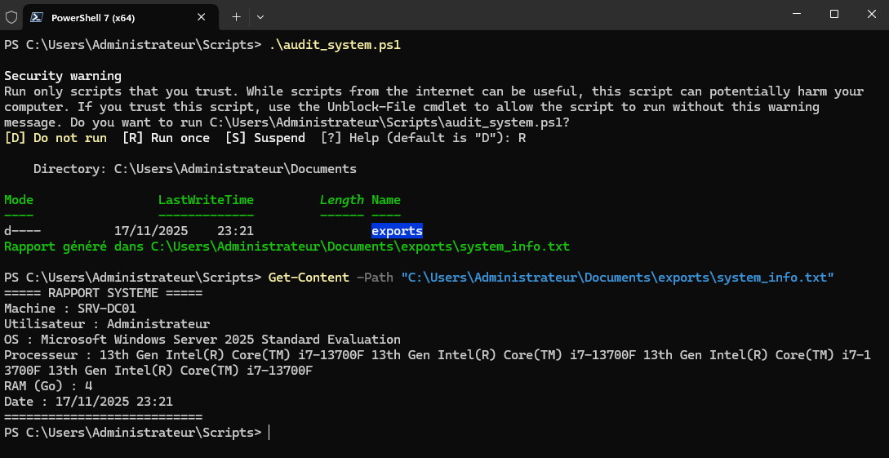


# Commandes pour l'Active Directory
## Installation d'active directory
# Installation du rôle AD DS
``` Powershell
Write-Host "Installation du rôle Active Directory Domain Services..." -ForegroundColor Green 
Install-WindowsFeature -Name AD-Domain-Services -IncludeManagementTools
``` 
Promotion du serveur en tant que contrôleur de domaine avec saisie sécurisée du mot de passe DSRM 
(Mode de restauration des services d'annuaire en français)
avec création de la forêt
``` Powershell
$dsrmPassword = Read-Host "Entrez le mot de passe DSRM" -AsSecureString
Install-ADDSForest -DomainName "EntrepriseXYZ.local" `
                   -SafeModeAdministratorPassword $dsrmPassword `
                   -InstallDNS `
                   -DomainNetbiosName "ENTREPRISEXYZ" `
                   -Force
Write-Host "Redémarrage du serveur pour finaliser l'installation d'Active Directory..." -ForegroundColor Yellow
````

### Créer les OU : Direction, RH, Informatique
````PowerShell
New-ADOrganizationalUnit -Name "Direction" -Path "DC=EntrepriseXYZ,DC=local" -ProtectedFromAccidentalDeletion $true
Write-Host "OU créée : Direction" -ForegroundColor Cyan
New-ADOrganizationalUnit -Name "RH" -Path "DC=EntrepriseXYZ,DC=local" -ProtectedFromAccidentalDeletion $true
Write-Host "OU créée : RH" -ForegroundColor Cyan
New-ADOrganizationalUnit -Name "Informatique" -Path "DC=EntrepriseXYZ,DC=local" -ProtectedFromAccidentalDeletion $true
Write-Host "OU créée : Informatique" -ForegroundColor Cyan

````
### Créer des utilisateurs dans chaque OU
````PowerShell
New-ADUser -Name "Marc Dupont" -GivenName "Marc" -Surname "Dupont" -SamAccountName "mdupont" -UserPrincipalName "mdupont@entreprisexyz.local" -Path "OU=Direction,DC=EntrepriseXYZ,DC=local" -AccountPassword (ConvertTo-SecureString "Password123!" -AsPlainText -Force) -Enabled $true
New-ADUser -Name "Claire Lemoine" -GivenName "Claire" -Surname "Lemoine" -SamAccountName "clemoine" -UserPrincipalName "clemoine@entreprisexyz.local" -Path "OU=Direction,DC=EntrepriseXYZ,DC=local" -AccountPassword (ConvertTo-SecureString "Password123!" -AsPlainText -Force) -Enabled $true
New-ADUser -Name "Paul Bernard" -GivenName "Paul" -Surname "Bernard" -SamAccountName "pbernard" -UserPrincipalName "pbernard@entreprisexyz.local" -Path "OU=Direction,DC=EntrepriseXYZ,DC=local" -AccountPassword (ConvertTo-SecureString "Password123!" -AsPlainText -Force) -Enabled $true
New-ADUser -Name "Sophie Durand" -GivenName "Sophie" -Surname "Durand" -SamAccountName "sdurand" -UserPrincipalName "sdurand@entreprisexyz.local" -Path "OU=RH,DC=EntrepriseXYZ,DC=local" -AccountPassword (ConvertTo-SecureString "Password123!" -AsPlainText -Force) -Enabled $true
New-ADUser -Name "Luc Meyer" -GivenName "Luc" -Surname "Meyer" -SamAccountName "lmeyer" -UserPrincipalName "lmeyer@entreprisexyz.local" -Path "OU=RH,DC=EntrepriseXYZ,DC=local" -AccountPassword (ConvertTo-SecureString "Password123!" -AsPlainText -Force) -Enabled $true
New-ADUser -Name "Anne Legrand" -GivenName "Anne" -Surname "Legrand" -SamAccountName "alegrand" -UserPrincipalName "alegrand@entreprisexyz.local" -Path "OU=RH,DC=EntrepriseXYZ,DC=local" -AccountPassword (ConvertTo-SecureString "Password123!" -AsPlainText -Force) -Enabled $true
New-ADUser -Name "Jean Martin" -GivenName "Jean" -Surname "Martin" -SamAccountName "jmartin" -UserPrincipalName "jmartin@entreprisexyz.local" -Path "OU=Informatique,DC=EntrepriseXYZ,DC=local" -AccountPassword (ConvertTo-SecureString "Password123!" -AsPlainText -Force) -Enabled $true
New-ADUser -Name "Eva Petit" -GivenName "Eva" -Surname "Petit" -SamAccountName "epetit" -UserPrincipalName "epetit@entreprisexyz.local" -Path "OU=Informatique,DC=EntrepriseXYZ,DC=local" -AccountPassword (ConvertTo-SecureString "Password123!" -AsPlainText -Force) -Enabled $true
New-ADUser -Name "David Moreau" -GivenName "David" -Surname "Moreau" -SamAccountName "dmoreau" -UserPrincipalName "dmoreau@entreprisexyz.local" -Path "OU=Informatique,DC=EntrepriseXYZ,DC=local" -AccountPassword (ConvertTo-SecureString "Password123!" -AsPlainText -Force) -Enabled $true
````

### Créer des groupes : GRP_Direction, GRP_RH, GRP_IT

````PowerShell
New-ADGroup -Name "GRP_Direction" -Path "OU=Direction,DC=EntrepriseXYZ,DC=local" -GroupScope Global -GroupCategory Security
New-ADGroup -Name "GRP_RH" -Path "OU=RH,DC=EntrepriseXYZ,DC=local" -GroupScope Global -GroupCategory Security
New-ADGroup -Name "GRP_IT" -Path "OU=Informatique,DC=EntrepriseXYZ,DC=local" -GroupScope Global -GroupCategory Security
````

### Assigner les utilisateurs aux groupes.
````PowerShell
Add-ADGroupMember -Identity "GRP_IT" -Members "jmartin"
Add-ADGroupMember -Identity "GRP_IT" -Members "epetit"
Add-ADGroupMember -Identity "GRP_IT" -Members "dmoreau"
Add-ADGroupMember -Identity "GRP_RH" -Members "sdurand"
Add-ADGroupMember -Identity "GRP_RH" -Members "lmeyer"
Add-ADGroupMember -Identity "GRP_RH" -Members "alegrand"
Add-ADGroupMember -Identity "GRP_Direction" -Members "mdupont"
Add-ADGroupMember -Identity "GRP_Direction" -Members "clemoine"
Add-ADGroupMember -Identity "GRP_Direction" -Members "pbernard"
````

### Créer des dossiers partagés et permissions NTFS.

````PowerShell
Import-Module SmbShare
Import-Module ActiveDirectory
````
Création du dossier principal
````PowerShell
New-Item -ItemType Directory -Path "C:\Users\Partages" -Force
````
Création des sous-dossiers
````PowerShell
New-Item -ItemType Directory -Path "C:\Users\Partages\Direction" -Force
New-Item -ItemType Directory -Path "C:\Users\Partages\RH" -Force
New-Item -ItemType Directory -Path "C:\Users\Partages\Informatique" -Force
````
Création des partages SMB
````PowerShell
New-SmbShare -Name "Direction" -Path "C:\Users\Partages\Direction" -FullAccess "GRP_Direction"
New-SmbShare -Name "RH" -Path "C:\Users\Partages\RH" -FullAccess "GRP_RH"
New-SmbShare -Name "Informatique" -Path "C:\Users\Partages\Informatique" -FullAccess "GRP_IT"
````
Configuration des permissions NTFS avec icacls
````PowerShell
icacls "C:\Users\Partages\Direction" /grant "GRP_Direction:(OI)(CI)F" /T
icacls "C:\Users\Partages\RH" /grant "GRP_RH:(OI)(CI)F" /T
icacls "C:\Users\Partages\Informatique" /grant "GRP_IT:(OI)(CI)F" /T
````
Après la création du domaine, vous modifierez le mot de passe du compte Administrateur du domaine :
````PowerShell
$password = Read-Host -AsSecureString "Entrez le mot de passe administrateur du domaine"
Set-ADAccountPassword -Identity "Administrateur" -Reset -NewPassword $password
Write-Host "Configuration Active Directory terminée." -ForegroundColor Green
Write-Host "N'oubliez pas de redémarrer le serveur pour appliquer toutes les modifications." -ForegroundColor Yellow
````

### Test de connexion au compte mdupont et de l'accès au partage

Sur le poste client appartenant au domaine, dans la session de l'utilisateur mdupont, j'ai bien accès au partage SMB :
 
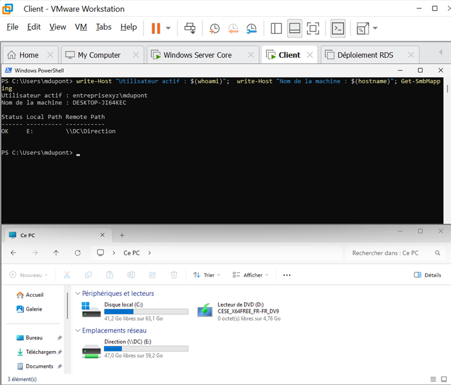

## Script général d'installation et de configuration d'Active Directory
Le fichier de sortie du script Active Directory se trouve [ici](exports/logs/transcriptAD_admin.txt)

Lors du lancement d'[ad_admin](scripts/ad_admin.ps1) on obtient cela : 

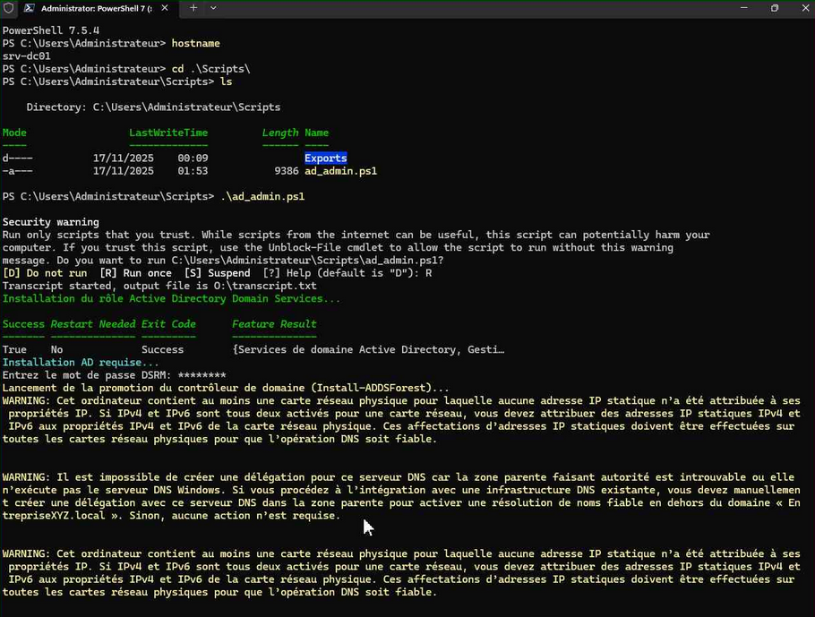

Fin du premier lancement du script :

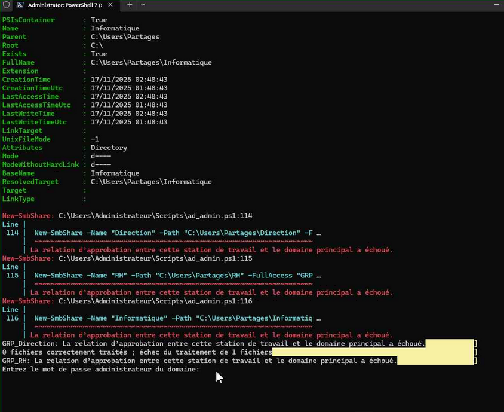

Début du second lancement du script :

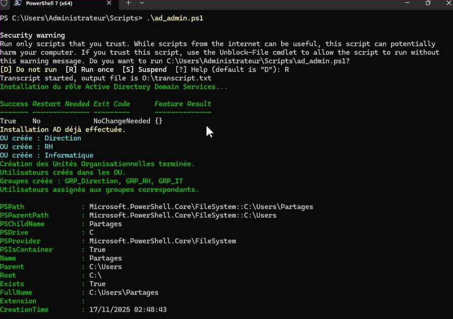

Milieu du second lancement du script :

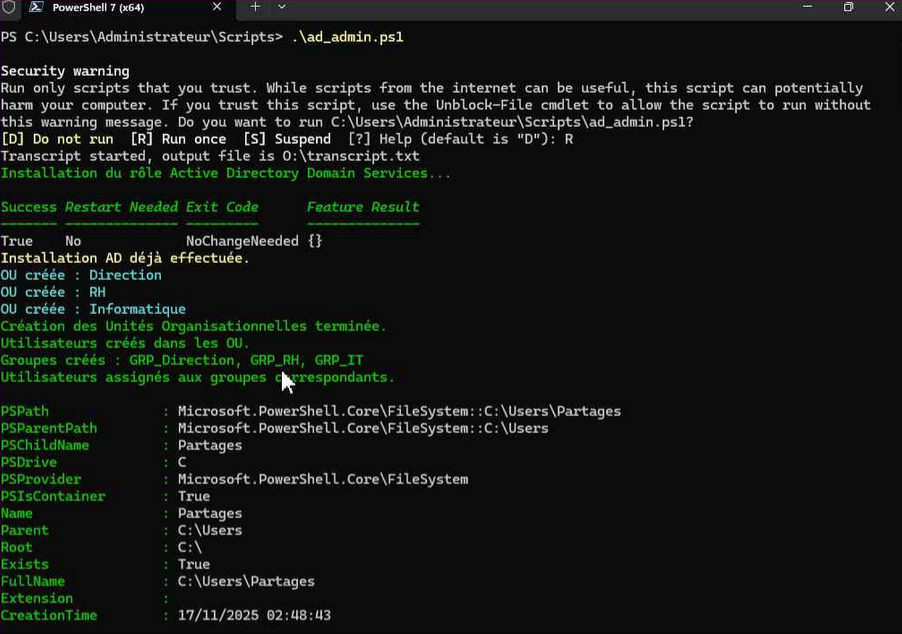

À la fin de la seconde exécution du script, j’ai la possibilité de renseigner le mot de passe du compte administrateur du domaine.

Fin du second lancement du script :

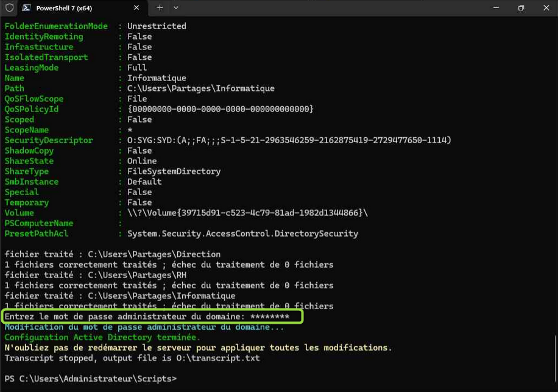

# Configuration du DNS.

## Création d'une zone primaire DNS et ajout d'un enregistrement hôte (A) pour le serveur principal

````pwsh
Get-WindowsFeature DNS
````

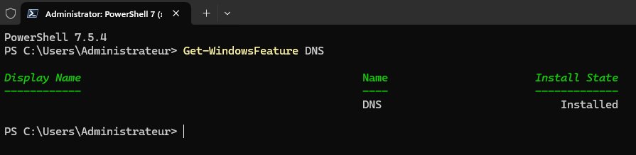


Affiche les détails de la zone DNS 'entreprisexyz.local'
````pwsh
Get-DnsServerZone -Name 'entreprisexyz.local'
````

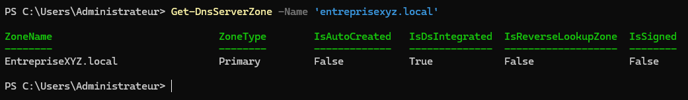

Supprime la zone DNS 'entreprisexyz.local'
````pwsh
Remove-DnsServerZone -Name 'entreprisexyz.local'
````
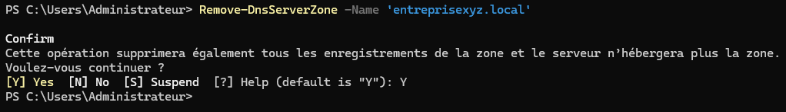

Crée une nouvelle zone primaire DNS avec réplication de domaine sécurisée
````pwsh
Add-DnsServerPrimaryZone -Name 'entreprisexyz.local' -ReplicationScope 'Domain' -DynamicUpdate Secure
````

Ajoute un enregistrement A pour srv-dc1 à l'adresse 192.168.147.10
````ps
Add-DnsServerResourceRecordA -Name 'srv-dc1' -ZoneName 'entreprisexyz.local' -IPv4Address '192.168.147.10'
````
Crée la zone de recherche inversée pour le sous-réseau 192.168.147.0/24
````PS 
Add-DnsServerPrimaryZone -NetworkID '192.168.147.0/24' -ReplicationScope 'Domain' -DynamicUpdate Secure
````

Ajoute un enregistrement PTR pour l'adresse 192.168.147.10
````PS 
Add-DnsServerResourceRecordPTR -Name '10' -ZoneName '147.168.192.in-addr.arpa' -PtrDomainName 'srv-dc1.entreprisexyz.local'
````

### Vérification que le DNS est bien configuré :

Récupération de tous les enregistrements DNS de type PTR dans la zone de recherche inverse 147.168.192.in-addr.arpa sur le serveur DNS local. 

````PS 
Get-DnsServerResourceRecord -ZoneName "147.168.192.in-addr.arpa" -RRType PTR
````
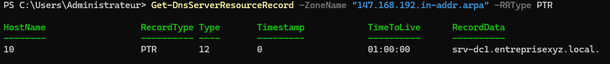

Enregistrements de type A dans la zone directe

````PS 
Get-DnsServerResourceRecord -ZoneName "entreprisexyz.local" -RRType A
````
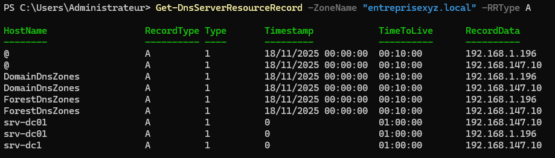

Résolution de srv-dc1 en zone directe et en zone inverse

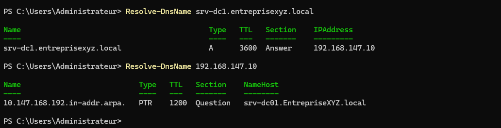


## Configuration d'un redirecteur DNS vers les serveurs publics de Google

````pwsh
PS C:\Windows\System32> Set-DnsServerForwarder -IPAddress 8.8.8.8,8.8.4.4
PS C:\Windows\System32> Get-DnsServerForwarder
````
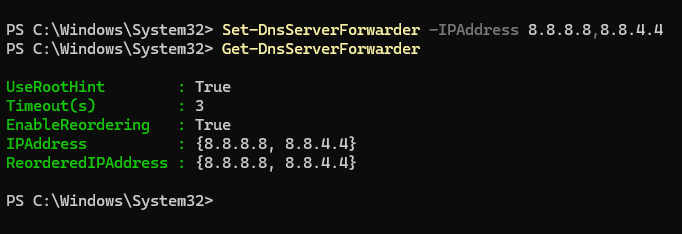


### Quelle est la différence entre un enregistrement A et un CNAME ?


Enregistrement A (Address Record)
- **Fonction** : Associe un nom de domaine à une **adresse IPv4**.
- **Exemple** : `example.com → 192.0.2.1`
- **Utilisation typique** : Pour pointer directement vers un serveur web, mail, etc.
- **Avantage** : Résolution directe, rapide, sans dépendance à d'autres noms.

---

### Enregistrement CNAME (Canonical Name Record)
- **Fonction** : Fait d’un nom de domaine un **alias** d’un autre nom de domaine.
- **Exemple** : `www.example.com → example.com`
- **Utilisation typique** : Pour simplifier la gestion DNS, rediriger plusieurs sous-domaines vers un nom principal.
- **Important** : Le CNAME ne peut pas coexister avec d'autres enregistrements (comme MX ou A) sur le même nom.

---

### Différences clés

| Aspect                  | Enregistrement A                  | Enregistrement CNAME               |
|------------------------|-----------------------------------|------------------------------------|
| Pointe vers            | Une adresse IP                    | Un autre nom de domaine            |
| Résolution             | Directe                           | Indirecte (nécessite une autre requête DNS) |
| Utilisation            | Serveurs, services directs        | Alias, redirections DNS            |
| Restrictions           | Aucun conflit avec autres types   | Ne peut pas coexister avec d'autres enregistrements sur le même nom |
| Performance            | Plus rapide (moins de requêtes)   | Légèrement plus lent (résolution en deux étapes) |

---

### Quelle commande permet de vérifier la liste des zones DNS existantes ?
La commande pour vérifier la liste des zones DNS existantes est 

````pwsh
Get-DnsServerZone
````

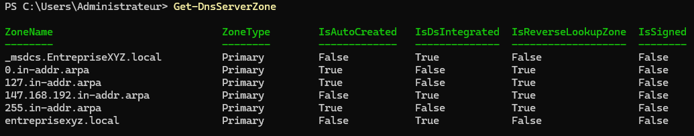


### Pourquoi utiliser un redirecteur dans un DNS d’entreprise ?

Un redirecteur DNS en entreprise permet d’optimiser la résolution des noms en redirigeant les requêtes vers des serveurs DNS externes ou spécialisés, améliorant ainsi la performance, la sécurité et la gestion du réseau. Un redirecteur DNS n’est pas un serveur récursif, mais un intermédiaire intelligent qui délègue la résolution selon des règles définies. Il est particulièrement utile dans les architectures complexes, les réseaux d’entreprise distribués, ou les scénarios de sécurité renforcée.

# DHCP
### Objectif :

Contexte :
Le réseau du lab utilise la plage d’adresses suivante : `192.168.147.0/24`
Étapes réalisées :
1. Création d’une étendue DHCP appelée `LAN_EntrepriseXYZ`.
2. Définition de la plage IP de `192.168.147.200` à `192.168.147.220`.
3. Configuration des options DHCP :
 - DNS : `192.168.147.10`
 - Passerelle : `192.168.147.1`
 - Domaine : `entreprisexyz.local`
4. Création d’une réservation d’adresse IP fixe pour un poste administratif.

- **DHCP** : attribution automatique d'adresses IP (réseau : `192.168.147.0/24`)

### Réseau de l'infrastructure

| Élément | Configuration |
|--------|---------------|
| Domaine | `entreprisexyz.local` |
| Réseau | `192.168.147.0/24` |
| Serveur DC/DNS | `192.168.147.10` |
| Passerelle | `192.168.147.1` |
| Plage DHCP | `192.168.147.200 - 192.168.147.220` |
| Serveur DHCP | `192.168.147.11` |
# – Installation et configuration 

````PS 
Install-WindowsFeature DHCP -IncludeManagementTools
````

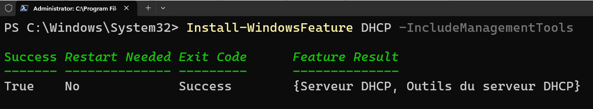

Autorise le serveur srv-dc1 dans l'AD

```PowerShell
Add-DhcpServerInDC -DnsName "srv-dc1.entreprisexyz.local" -IPAddress 192.168.147.10
```

Création d'une plage d'adresses pour l'étendue du DHCP

```ps
Add-DhcpServerv4Scope -Name "LAN_EntrepriseXYZ" -StartRange 192.168.147.200 -EndRange 192.168.147.220 -SubnetMask 255.255.255.0 -State Active
```

Une fois l'étendue créée, il faut dire aux clients quelle passerelle et quel DNS utiliser

```ps
Set-DhcpServerv4OptionValue -ScopeId 192.168.147.0 -DnsServer 192.168.147.10
Set-DhcpServerv4OptionValue -ScopeId 192.168.147.0 -Router 192.168.147.1
Set-DhcpServerv4OptionValue -ScopeId 192.168.147.0 -DnsDomain "entreprisexyz.local"
```
Voici une capture d'écran de mon terminal pour ces commandes :

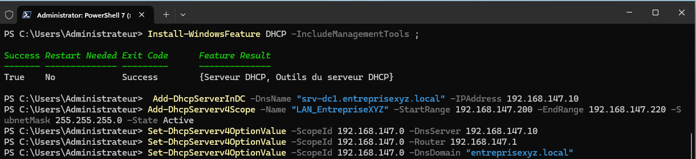

### La Réservation du poste administratif se fait par cette commande :

````PS 
Add-DhcpServerv4Reservation -ScopeId 192.168.147.0 -IPAddress 192.168.147.216 -ClientId "000C29B1F2DE" -Name "RES-PosteAdmin" -Description "Réservation du poste administratif (MAC: 00-0C-29-B1-F2-DE)"
````

### Côté client test de l'attribution de l'adresse IP sur le poste avec l'adresse MAC 00-0C-29-B1-F2-DE

Sur un poste client du domaine, connecté sur une session entreprisexyz\mdupont, il faut se connecter en administrateur local pour activer la configuration DHCP sur l’interface Ethernet0 

Pour mettre l'interface réseau en mode client DHCP, je tape cette commande :

````PowerShell
Set-NetIPInterface -InterfaceAlias "Ethernet0" -Dhcp Enabled
````
Par ces 3 commandes on constate que l’adresse IP attribuée est bien liée à l’adresse MAC :

````pwsh 
Get-NetIPInterface -InterfaceAlias "Ethernet0" | Where-Object {$_.AddressFamily -eq "IPv4"} | Select-Object InterfaceAlias, AddressFamily, Dhcp
(Get-NetAdapter -InterfaceAlias "Ethernet0").MacAddress
(Get-NetIPConfiguration -InterfaceAlias "Ethernet0").IPv4Address.IPAddress
````

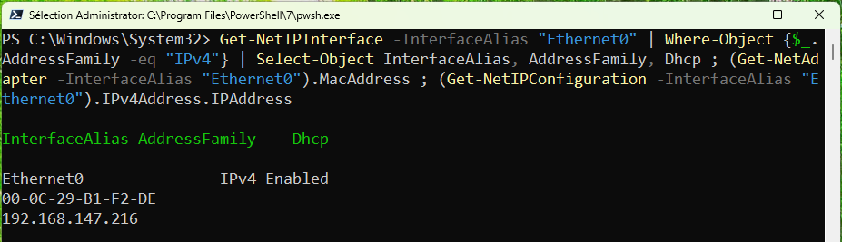


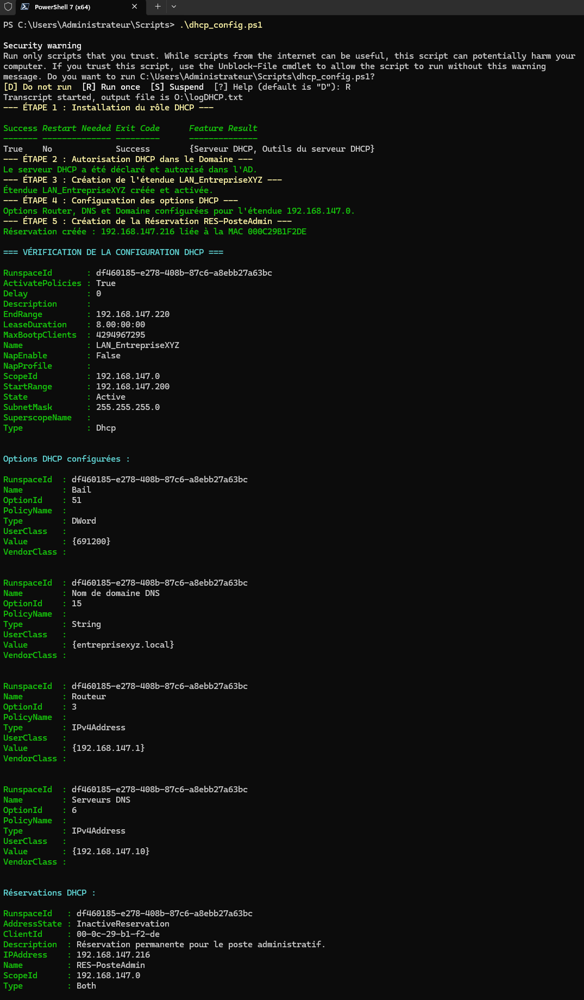
